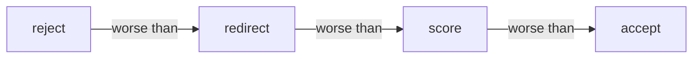
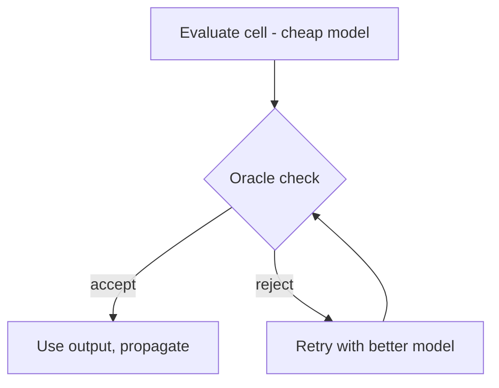
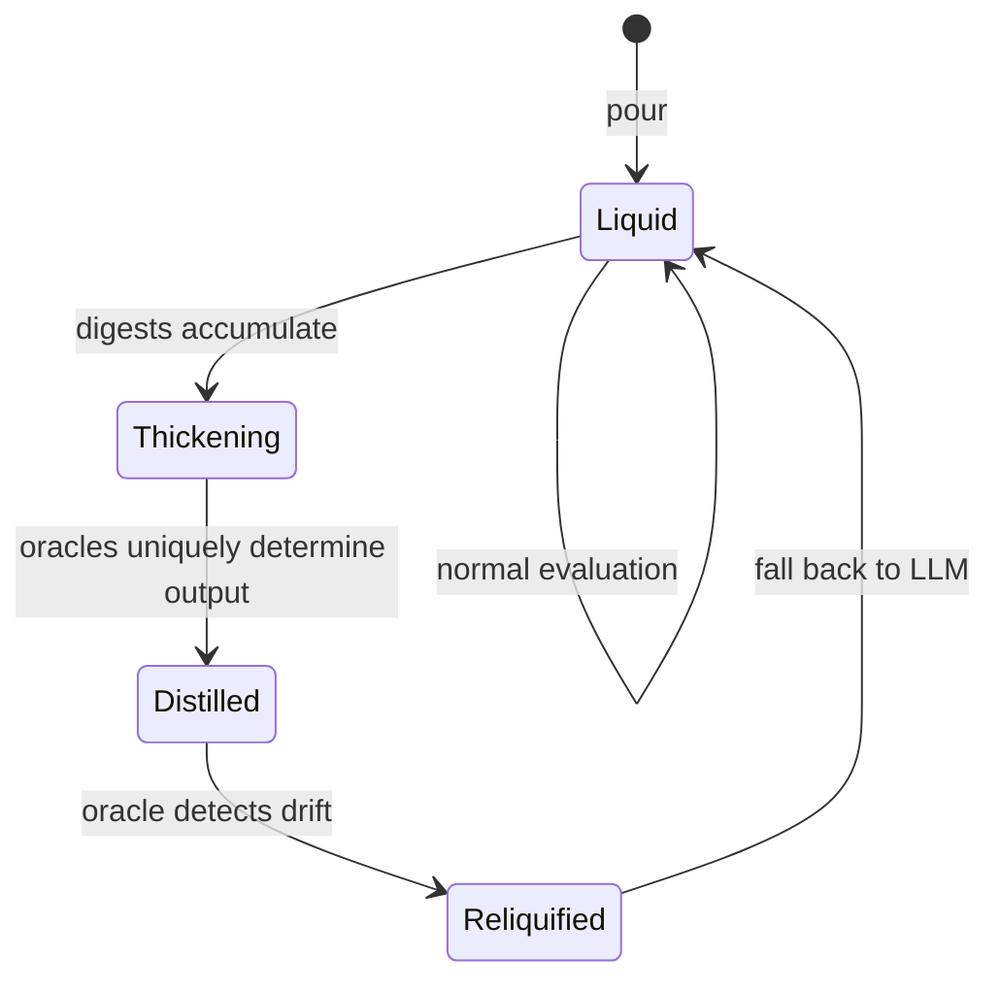
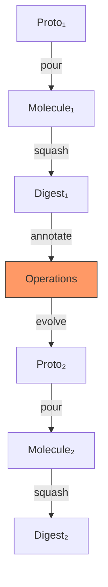
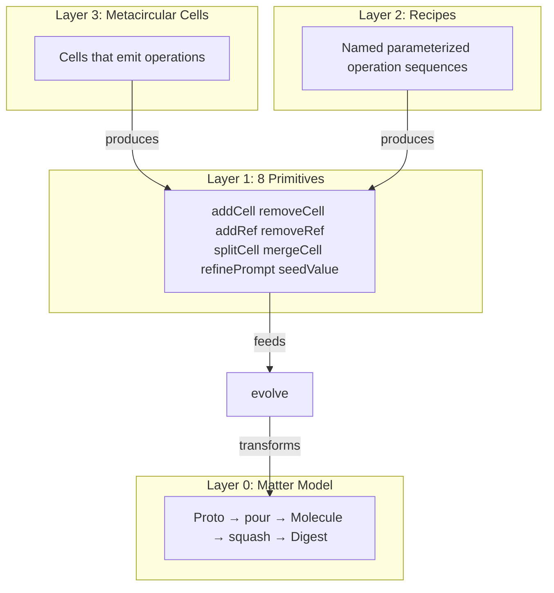

# Formula Engine v2

**Date**: 2026-03-08
**Status**: Approved
**Epic**: gt-wg6

---

## The Point

Formulas today are TOML checklists. Agents follow them like scripts. Nothing
checks whether a step produced garbage before the next step consumes it.
Nothing knows when upstream work changes. Nothing composes.

Formula Engine v2 makes formulas a **reactive, typed, self-evolving language**.

## What's Needed

Three capabilities that Gas Town currently lacks:

1. **Oracles on wires.** A cheap check between beads that rejects bad output
   before downstream work wastes tokens on it. Oracles ARE the type system.
2. **Graph operations as a language.** Eight primitive operations that transform
   a molecule's structure. Composable into recipes. Expressible by cells themselves.
3. **Distillation.** Over time, an LLM cell accumulates enough history that you
   can replace it with a deterministic function. The oracle verifies equivalence.
   The graph discovers its own program.

## Mapping to Gas Town

Every concept maps to something that already exists:

| Formula v2 | Gas Town Today | What Changes |
|------------|---------------|-------------|
| Cell | Bead | Beads gain an oracle (cheap output check) |
| Wire | `--deps` on `bd create` | Deps gain type: oracle on the wire validates data flow |
| Ready set | `bd ready` | Same — unblocked beads with all oracles passing |
| Evaluate | `bd update --claim` + `bd close` | Same — but oracle checks output before close propagates |
| Staleness | (missing) | New: when upstream closes with new content, downstream beads go stale |
| Proto | Formula TOML | Same — template for a molecule |
| Molecule | Active formula instance | Same — running workflow |
| Digest | Squashed molecule | Same — immutable record of completed work |
| Recipe | (missing) | New: named, parameterized operation sequences |
| Oracle | (missing) | New: cheap check on bead output, can be a cell itself |

The runtime is Gas Town. The data plane is Dolt. The agents are polecats.
Formula v2 adds **oracles**, **typed wires**, **graph operations**, and
**distillation** on top of what already works.

---

## Oracles

An oracle is a cheap check that gates what flows through a wire between beads.
It exploits a fundamental asymmetry: **verifying an answer is cheaper than
generating it.**

### Oracles Are Cells

An oracle can be:
- A deterministic function (regex, JSON schema check, hash comparison) — zero tokens
- A cheap LLM call ("does this JSON contain a 'types' key? yes/no") — ~100 tokens
- A full cell in the graph — another bead whose job is verification

When an oracle is itself a cell, it participates in the same DAG. It can have
its own oracles. It can distill. The system is uniform: there is no special
"oracle layer" — just cells, some of which verify other cells.

### Oracle Verdicts



- **accept** — output passes, propagate downstream
- **score(quality)** — passes with a quality annotation
- **redirect(cell)** — valid but wrong destination, reroute
- **reject(reason)** — fails, retry or escalate

When multiple oracles check the same wire, the most restrictive verdict wins.

### Subtyping

Wire A → B is valid when everything A's oracle accepts, B's oracle also accepts.
No declared schemas. The oracle IS the type. Subtyping IS oracle implication.

### The Asymmetry



A 100-token oracle check that catches a bad 10,000-token cell saves everything
downstream. The savings multiply with pipeline depth.

## Cells: Deterministic and Non-Deterministic

Not every cell is an LLM call. A cell is any computation with typed inputs
and an output:

| Cell kind | Example | Cost | Deterministic? |
|-----------|---------|------|---------------|
| LLM cell | "Summarize {{source}}" | High (tokens) | No |
| Script cell | `jq '.types | length'` | Zero | Yes |
| Oracle cell | "Does {{output}} match schema?" | Low | Yes or No |
| Metacircular cell | Emits graph operations | High | No |
| Distilled cell | Was LLM, now a function | Zero | Yes |

The system doesn't care whether a cell is deterministic. It cares whether
the oracle passes. A distilled cell is just a cell that became deterministic
through observation.

## Distillation

A cell starts as an LLM call. Over generations, its oracles tighten from
observation. When the oracle constraints uniquely determine the output for
a given input class, the LLM is replaceable with a deterministic function.



**Liquid**: LLM evaluates, oracle gatekeeps. High cost.

**Thickening**: Digests pile up. Oracle set tightens from patterns.

**Distilled**: Deterministic function replaces LLM. Oracle still runs —
verifying equivalence. Zero token cost.

**Re-liquified**: Input distribution shifts, distilled function fails oracle.
Fall back to LLM. The system self-heals.

The endgame: the graph starts as a web of LLM calls and gradually crystallizes
into a mostly-deterministic program with LLM fallback for novelty. The LLMs
were the search process that found the right functions. The oracles are the
proof they're correct.

## The 8 Operations

Eight primitives that transform a molecule's structure:

### Minimal Basis

These four can express any DAG-to-DAG transformation:

| Operation | What it does |
|-----------|-------------|
| `addCell(spec)` | Add a bead to the molecule |
| `removeCell(cell)` | Remove a bead |
| `addRef(cell, ref)` | Wire a new dependency |
| `removeRef(cell, ref)` | Cut a dependency |

### Semantic Operations

These four are derivable from the minimal basis but preserve wiring invariants:

| Operation | What it does | Why it exists |
|-----------|-------------|--------------|
| `splitCell(cell, [a, b])` | Decompose one bead into many | Forks downstream wires correctly |
| `mergeCell([a, b], merged)` | Combine beads into one | Unions upstream wires correctly |
| `refinePrompt(cell, prompt)` | Change a bead's instruction | Validates refs in prompt |
| `seedValue(cell, value)` | Pre-fill from prior digest | Skips LLM when answer is known |

## Recipes

A recipe is a named, parameterized sequence of operations. Zero token cost.
Agents use recipes by filling in parameters — they don't need to understand
DAG invariants.

```
recipe enrich(target, source_prompt, refined_prompt):
  src = addCell({ prompt: source_prompt })
  addRef(target, src)
  refinePrompt(target, refined_prompt)

recipe insert_gate(after, before, gate_type):
  gate = addCell({ type: gate_type, refs: [after] })
  removeRef(before, after)
  addRef(before, gate)
```

Example: `enrich(ratio_analysis, "Get consensus estimates...", "Compare to {{consensus}}...")`
adds a data source bead, wires it in, and updates the prompt — three operations,
one recipe call, zero tokens.

## Metacircular Evolution

A cell can emit graph operations as its output. Those operations modify the
**next generation's** proto, never the current molecule.



The orange box is where recipes and metacircular cells produce operations.
Both output the same thing: a list of the 8 primitives. Recipes are verified
and free. Metacircular cells are validated at runtime and cost tokens.

### Stratification

No self-modification within a generation. The molecule DAG is fixed during
execution. Operations from this generation's cells apply to the next
generation's proto. Cycles emerge across generations, never within them.

This is why molecules work: each generation is a clean DAG. The feedback
loop lives in the chain of generations, not inside any single molecule.

## Content-Addressed Cells

Inspired by the Unison programming language, cells are identified by a
**content hash** of their definition:

```
cell_hash = hash(prompt + sorted(ref_hashes) + oracle_hash)
```

### What This Buys Us

1. **Names are metadata, not identity.** Cell names are pointers into the
   hash space. Renaming is free. Two names can point to the same cell.

2. **Edits create new hashes, not mutations.** The old cell persists. A
   "stale list" shows which downstream cells still reference the old version
   and need re-evaluation — this IS the reactive staleness propagation.

3. **No broken states.** Old hashes are immutable. Partial edits don't
   corrupt the graph. Every snapshot is consistent.

4. **Evaluate once, cache forever.** Once a cell's digest is computed for
   a given input hash, it never needs recomputation. The cache key is the
   hash itself. This is how distillation works at the storage level.

5. **Evolution history is append-only.** Each proto snapshot is itself
   content-addressable. History becomes a chain of immutable snapshots —
   like Dolt commits, but at cell granularity.

### Mapping to Gas Town

Dolt already content-addresses data (every commit is a hash). Beads already
have IDs. The addition: bead definitions (prompt + deps + oracle) get hashed.
When you `refinePrompt`, you don't mutate the bead — you create a new hash.
Downstream refs point at the old hash until they're explicitly evolved.

This means `bd ready` becomes: "which beads have all upstream hashes at
their latest version?" Staleness = "my refs point at old hashes."

## The Architecture (Layered)



Both Layer 2 and Layer 3 produce the same output: a list of primitives.
Two on-ramps to the same `evolve` function.

## Yegge Bot

*These are not Steve Yegge's actual opinions. They are a simulated critic
based on his public writing about platforms, compression, and language design.*

| Yegge Bot Says | How v2 Responds |
|----------------|----------------|
| "Formulas aren't a real language" | Recipes + metacircular cells = composable graph evolution language |
| "No typed wires — it's a task tracker" | Oracle-typed wires = behavioral contracts between beads |
| "Platform not product" (Bezos Mandate) | Every bead is a service with an oracle interface. Third parties can compose. |
| "Compression is the central challenge" | Distillation IS compression — replace expensive LLM with cheap function |
| "Keep the math invisible" | Agents see recipes and oracles, not the algebra underneath |

## Design Principles

1. **Oracles are types.** No schemas. Wire validity = oracle compatibility.
2. **Oracles are cells.** An oracle can be a bead in the graph. Uniform.
3. **Cells can be deterministic or not.** The system doesn't care. The oracle does.
4. **Recipes are the common case.** Zero tokens. Agents fill parameters.
5. **Metacircular cells are the escape hatch.** For novel restructuring. Costs tokens.
6. **Stratified evolution.** No self-modification within a generation.
7. **Distillation is convergence.** Oracles tighten until LLM is replaceable.
8. **Content-addressed.** Cells identified by hash. Edits create new hashes. Cache forever.
9. **Checking is cheaper than generating.** Exploit this asymmetry everywhere.

## Risks

| Risk | Mitigation |
|------|-----------|
| Dolt write amplification | Batch commits per evaluation round |
| Oracle too strict | Start loose, tighten from observation. `score` verdict for soft signals |
| Agents can't use raw operations | Recipes abstract invariants. Layer 3 = escape hatch |
| Staleness cascade | Lazy: stale beads don't auto-evaluate. Budget caps |
| Metacircular drift | Well-formedness oracle validates emitted ops before apply |
| Distillation wrong on new inputs | Re-liquification on oracle failure. Oracle always runs |

## Open Questions

1. How to write the language — syntax, semantics, tooling. Explore Unison-style
   content-addressed definitions, structural editing, hash-based references.

2. What triggers distillation — manual, automatic (N identical outputs), or
   oracle-driven (constraints uniquely determine output)?

3. Cross-molecule oracle composition — when `gt sling` wires molecules together,
   do oracles inherit or need fresh specification?

4. Recipe representation — TOML extension? Embedded DSL? Something new?
